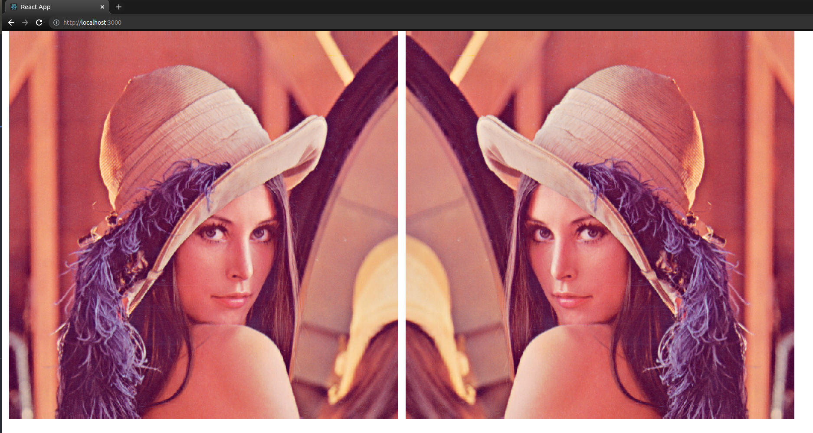

# emscripten-vision-react-example

This repo contains an example that compile OpenCV C++ code into wasm, and runs the generated wasm code in React app. It includes:

* How to set up build to generate wasm from custom opencv C++ code
* How to load wasm into react and call the custom functions.



## How to build and run?

### Step 1: Install Required packages

To compile C++ code into wasm and run the React app, we need:
1. emscripten, install by following instructions in https://emscripten.org/docs/getting_started/downloads.html
2. node.js

### Step 2: Compile OpenCV

1. `git submodule update --init --recursive` to pull opencv repo
2. Find out your emscripten path `$EMSCRIPTEN_PATH`
3. Build opencv wasm by running `EMSCRIPTEN=$EMSCRIPTEN_PATH python3 opencv/platforms/js/build_js.py opencv/build_wasm --build_wasm`

For linux machine, the common EMSCRIPTEN_PATH is `export EMSCRIPTEN_PATH=~/emsdk/upstream/emscripten`

### Step 3: [Can Skip] Set up Cpp in VSCode

Modify and add the path to workspace.json.
```
{
    "C_Cpp.default.includePath": [
        "${workspaceFolder}/opencv/include",
        "/home/randxie/emsdk/upstream/emscripten/system/include",
    ],
}
```

### Step 4: Compile C++ into wasm

```
make build-wasm
```

It will generate `vision_utils.js` that gets copied to `app/src`.

### Step 5: Install React App Deps

```
cd app & npm install
```

### Step 6: Run the react app

```
make run-app
```

## Reference

1. https://github.com/taylorjg/emscripten-opencv
2. https://blog.logrocket.com/image-styling-and-filters-using-webassembly/